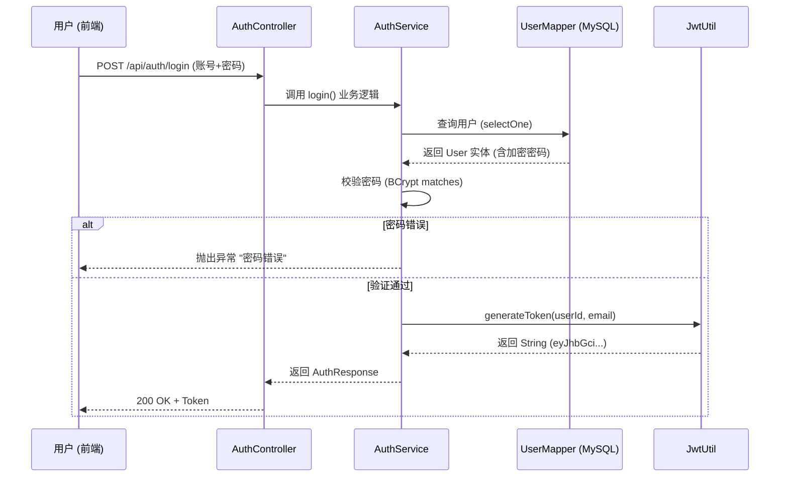

# AI驱动博客系统需求文档
## 1. 项目概述

SmartWardrobe AI 是一个利用 Google Gemini 3 系列模型构建的智能时尚管理应用。它旨在通过 AI 解决用户“不知道怎么穿”、“衣服太多记不住”以及“线上试穿”的需求。

## 功能模块

### 管理端

#### 用户认证与管理

1. 用户登录
2. 用户列表查看
   - 管理端用户
   - APP端用户

#### AI模型管理

1. 模型新增
2. 模型修改
3. 模型查看筛选
4. 模型删除
5. 模型禁用


<<<<<<< Current (Your changes)
#### 数据字典

1. 


#### 存储管理

1. Minio文件查看
2. Minio存储桶统计
3. Minio文件管理
=======
#### 存储管理

1. Minio文件查看
2. Minio存储桶统计
3. Minio文件管理


### APP端


- 用户注册与登录
- 博客文章的增删改查
- 评论与点赞
- 后台管理（用户管理、内容审核）
- AI助手（根据主题自动生成文章内容）
## 技术栈
- 后端：Go（Gin框架）、PostgreSQL
- 前端：Next.js、Tailwind CSS
- AI接口：OpenAI GPT-4
- 容器：Docker + Devbox（开发环境）
## 接口示例
- `POST /api/article` ：创建文章
- `GET /api/articles` ：获取文章列表
- `POST /api/article/generate` ：AI自动生成文章


# SmartWardrobe AI 开发者指南与技术规格


>>>>>>> Incoming (Background Agent changes)


### APP端

#### 用户认证与管理

**需求描述：** 前端需要识别用户身份，以隔离不同用户的衣橱数据。

1. 注册
2. 登录
3. 个人数据管理

## 技术栈
- 后端：Go（Gin框架）、PostgreSQL
- 前端：Next.js、Tailwind CSS
- AI接口：OpenAI GPT-4
- 容器：Docker + Devbox（开发环境）
## 接口示例
- `POST /api/article` ：创建文章
- `GET /api/articles` ：获取文章列表
- `POST /api/article/generate` ：AI自动生成文章


# SmartWardrobe AI 开发者指南与技术规格


## 2.核心功能模块需求

- 

**数据落地要求：**

- 密码必须加密存储 (BCrypt)。
- 用户 ID 将作为所有业务表的外键。


#### 数据库设计

`users`

```sql
-- [MySQL 8.0]
-- 如果表已存在，请执行 ALTER 语句；如果是新库，直接运行 CREATE。

DROP TABLE IF EXISTS `users`;

CREATE TABLE `users` (
    `id` BIGINT AUTO_INCREMENT PRIMARY KEY,
    `username` VARCHAR(50) NOT NULL COMMENT '昵称',
    `email` VARCHAR(100) UNIQUE COMMENT '邮箱 (登录凭证1)',
    `phone` VARCHAR(20) UNIQUE COMMENT '手机号 (登录凭证2)',
    `password_hash` VARCHAR(255) NOT NULL COMMENT 'BCrypt加密密码',
    `avatar_url` VARCHAR(512) COMMENT '头像URL',
    `height` INT COMMENT '身高(cm)',
    `weight` INT COMMENT '体重(kg)',
    `create_time` DATETIME DEFAULT CURRENT_TIMESTAMP,
    `update_time` DATETIME DEFAULT CURRENT_TIMESTAMP ON UPDATE CURRENT_TIMESTAMP,
    -- 确保至少有一个联系方式不为空的约束通常由代码控制，或者使用复杂的 Check Constraint
    INDEX `idx_email` (`email`),
    INDEX `idx_phone` (`phone`)
) ENGINE=InnoDB DEFAULT CHARSET=utf8mb4 COMMENT='用户核心表';
```


#### 接口设计

> 发送注册/登录验证码  /api/auth/send-code


> 邮箱注册


> 手机号验证码登录/注册 (一体化)


> 传统密码登录 (支持手机号或邮箱，但前提是有密码)


### 2.2 智能衣橱管理 (Smart Wardrobe)

**需求描述：** 这是核心资产库。后端需要处理图片的上传、存储、元数据分析和检索。

1. **图片上传与存储**：
   - 接收前端上传的图片文件。
   - **关键点**：图片文件存入对象存储（如 MinIO/OSS/S3），数据库仅存 URL 路径。严禁将图片二进制存入 MySQL。


2. **衣物存储**

   > 核心业务逻辑 
   >
   > ### 1.1 身体部位与层级逻辑 (核心难点)
   >
   > 为了支持 AI 试穿，我们将衣服分为 **5 大互斥部位 (Region)** 和 **3 大堆叠层级 (Layer)**。
   >
   > - **基本规则**：不同部位互不冲突；同一部位按层级排序。
   > - **冲突规则**：`DRESS` (全身) 同时占用 `TOP` (上装) 和 `BOTTOM` (下装) 的 **内层(Inner)与中层(Middle)**，但允许与 `TOP` 的 **外层(Outer)** 共存。

   | **部位 (Region)** | **说明**   | **包含品类示例**      | **允许层级 (Layer)** |
   | ----------------- | ---------- | --------------------- | -------------------- |
   | **TOP**           | 上身       | T恤, 卫衣, 衬衫, 夹克 | 1(内), 2(中), 3(外)  |
   | **BOTTOM**        | 下身       | 牛仔裤, 短裙, 短裤    | 1(内), 2(中/外)      |
   | **DRESS**         | 全身(特殊) | 连衣裙, 连体裤        | 2 (通常视为中层)     |
   | **SHOES**         | 脚部       | 运动鞋, 靴子          | - (独立替换)         |
   | **ACC**           | 配饰       | 帽子, 围巾, 包        | 4 (顶层)             |


#### 核心功能

1. 服装智能分析
2. 新增服装
3. 查询


1. 上传衣物+AI自动标注

   >调用AI获取衣物信息（默认填写，用户可更改），且生成“纯净”抠图版本照片 

   ```tex
   业务逻辑
   1.用户上传：上传一件卫衣
   系统生成：imageId（附件id）
   AI判断：maskImageId（去底图）、品类（category）、部位（region）、color（颜色）、season（适用季节）、layerIndex（穿衣层级）、fitType（版型）、viewType（图片视角）
   用户补充：name（衣物名称）、shelfNo（货架号）、price（价格）、purchaseDate（购买时间）、brand（品牌）、size（大小）
   2.系统判断：识别为 Category: Hoodie -> 自动写入 default_layer = 2 (Middle)
   
   
   逻辑1：AI识别category，按照映射关系填充region和layerIndex
   
   
   
   
   
   
   
   ```

2. 新增衣物


#### 业务逻辑

1.上传衣服图片->后端AI识别出category、color、season、fitType、viewType、maskImageId

2.前端拿到后端返回的数据，编辑和补充name（衣物名称）、shelfNo（货架号）、price（价格）、purchaseDate（购买时间）、brand（品牌）、size（大小），补充的都是非必填

3.新增衣物


3. 查询衣物

```
1.封装VO（图像url）
2.分页查询
3.多维度筛选
```


2. AI试穿逻辑

   ```
   1. 定义部位 (Region)
   AI 试穿算法（如 OOTDiffusion, IDM-VTON）通常把人体划分为这几个核心遮罩区域（Mask Regions）：
   
   UPPER_BODY (上身)：T恤、衬衫、毛衣、外套。
   
   LOWER_BODY (下身)：牛仔裤、短裙、短裤。
   
   DRESS (连体/全身)：连衣裙、连体裤。（注意：它会同时占用上身和下身，这是个特殊互斥逻辑）。
   
   FEET (脚部)：运动鞋、靴子。
   
   ACCESSORY (配饰)：帽子、围巾、包包。（配饰比较特殊，通常是覆盖在所有层级之上的）。
   
   2. 定义层级 (Layer) —— 仅对上身/下身有效
   Layer 1 (Inner): 内衣、打底衫、秋裤。
   
   Layer 2 (Middle): T恤、衬衫、卫衣、普通裤子。
   
   Layer 3 (Outer): 夹克、大衣、羽绒服。
   ```

   

#### 数据库设计

```sql
#附件表
CREATE TABLE `sys_file` (
  `id` bigint NOT NULL AUTO_INCREMENT,
  `file_name` varchar(255) DEFAULT NULL COMMENT '原始文件名',
  `file_path` varchar(500) DEFAULT NULL COMMENT '文件存储路径(OSS Key)',
  `file_url` varchar(500) DEFAULT NULL COMMENT '完整访问URL(快照)',
  `file_size` bigint DEFAULT NULL COMMENT '文件大小(字节)',
  `file_type` varchar(10) DEFAULT NULL COMMENT '扩展名(jpg/png)',
  `platform` varchar(20) DEFAULT 'qiniu' COMMENT '存储平台(qiniu/aliyun/local)',
  `create_by` varchar(64) DEFAULT NULL COMMENT '上传人',
  `create_time` datetime DEFAULT NULL,
  `update_time` datetime DEFAULT NULL,
  PRIMARY KEY (`id`)
) ENGINE=InnoDB DEFAULT CHARSET=utf8mb4 COMMENT='文件记录表';

-- 添加 file_hash 字段
ALTER TABLE sys_file ADD COLUMN file_hash VARCHAR(64) COMMENT '文件内容哈希(MD5)';

-- 加个索引，以后查得快
CREATE INDEX idx_file_hash ON sys_file(file_hash);
```


```sql
#衣物表
DROP TABLE IF EXISTS `clothing`;

CREATE TABLE `clothing` (
  `id` bigint(20) NOT NULL AUTO_INCREMENT COMMENT '主键ID',
  `user_id` bigint(20) NOT NULL COMMENT '所属用户ID',
  
  -- ================= 核心图片区 =================
  `image_id` bigint(20) NOT NULL COMMENT '原始图片ID (关联sys_file id)',
  `mask_image_id` bigint(20) DEFAULT NULL COMMENT 'AI抠图后的透明底图ID (关联sys_file id)',
  
  -- ================= 核心分类 (业务逻辑关键) =================
  `name` varchar(64) NOT NULL COMMENT '衣物名称 (例如: 我的白T恤)',
  
  `region` varchar(32) NOT NULL COMMENT '部位 (Region): TOP(上装)/BOTTOM(下装)/DRESS(全身)/SHOES(鞋)/ACCESSORY(配饰)',
  `category` varchar(32) NOT NULL COMMENT '具体品类 (Category): T-shirt/Jeans/Hoodie/Coat...',
  
  `default_layer` int(11) DEFAULT 2 COMMENT '建议层级: 1-Inner(贴身), 2-Middle(常规), 3-Outer(外套), 4-Accessory(配饰)',
  
  -- ================= AI 识别属性 (AI分析结果) =================
  `color` varchar(32) DEFAULT NULL COMMENT '主色调',
  `season` varchar(32) DEFAULT NULL COMMENT '适用季节 (Spring/Summer/Autumn/Winter)',
  `fit_type` varchar(32) DEFAULT 'Regular' COMMENT '版型: Slim(修身)/Regular(标准)/Loose(宽松)/Oversize',
  `view_type` varchar(32) DEFAULT 'Flat' COMMENT '视角: Flat(平铺)/Hanger(挂拍)/Model(模特)/Folded(折叠)',
  
  -- ================= 用户补充信息 (管理属性) =================
  `shelf_no` varchar(32) DEFAULT NULL COMMENT '货架号/收纳位置 (例如: A-1-05)',
  `brand` varchar(64) DEFAULT NULL COMMENT '品牌',
  `size` varchar(32) DEFAULT NULL COMMENT '尺码 (S/M/L/XL/40/42)',
  `price` decimal(10,2) DEFAULT NULL COMMENT '购买价格',
  `purchase_date` date DEFAULT NULL COMMENT '购买日期',
  
  -- ================= 状态与统计 =================
  `status` tinyint(4) DEFAULT 1 COMMENT '状态: 1-在柜, 2-洗衣中, 3-借出, 0-丢弃/回收',
  `wear_count` int(11) DEFAULT 0 COMMENT '穿着次数统计',
  
  -- ================= 系统字段 =================
  `create_time` datetime DEFAULT CURRENT_TIMESTAMP COMMENT '创建时间',
  `update_time` datetime DEFAULT CURRENT_TIMESTAMP ON UPDATE CURRENT_TIMESTAMP COMMENT '更新时间',
  `del_flag` tinyint(1) DEFAULT 0 COMMENT '逻辑删除 (0:正常, 1:删除)',
  
  PRIMARY KEY (`id`),
  KEY `idx_user_id` (`user_id`),
  KEY `idx_region` (`region`),
  KEY `idx_category` (`category`)
) ENGINE=InnoDB DEFAULT CHARSET=utf8mb4 COMMENT='智能衣物表';
```


```sql
#AI模型表
DROP TABLE IF EXISTS `sys_ai_model`;

CREATE TABLE `sys_ai_model` (
  `id` bigint(20) NOT NULL AUTO_INCREMENT,
  `model_key` varchar(64) NOT NULL COMMENT '前端传参的标识 (如: qwen-plus)',
  `label` varchar(64) NOT NULL COMMENT '前端展示名称 (如: 通义千问VL Plus)',
  `model_name` varchar(64) NOT NULL COMMENT '实际调用模型名 (如: qwen-vl-plus)',
  `base_url` varchar(255) NOT NULL COMMENT '接口地址',
  `api_key` varchar(128) NOT NULL COMMENT 'API Key',
  
  -- === 核心变更开始 ===
  `support_thinking` tinyint(1) DEFAULT 0 COMMENT '能力开关: 是否支持思考模式',
  `max_thinking_budget` bigint(20) DEFAULT 4096 COMMENT '风控限制: 最大允许的思考Token数',
  `default_enable_thinking` tinyint(1) DEFAULT 0 COMMENT '默认配置: 若前端未传，是否默认开启',
  `default_thinking_budget` bigint(20) DEFAULT 1024 COMMENT '默认配置: 若前端未传，默认Token数',
  -- === 核心变更结束 ===

  `sort` int(11) DEFAULT 0 COMMENT '排序',
  `status` tinyint(1) DEFAULT 1 COMMENT '状态: 1启用 0禁用',
  `create_time` datetime DEFAULT CURRENT_TIMESTAMP,
  `update_time` datetime DEFAULT CURRENT_TIMESTAMP ON UPDATE CURRENT_TIMESTAMP,
  PRIMARY KEY (`id`),
  UNIQUE KEY `uk_model_key` (`model_key`)
) ENGINE=InnoDB DEFAULT CHARSET=utf8mb4 COMMENT='AI模型配置表';
```


#### 接口设计

> 上传图片


1. 

### 数据字典

字典类型表

字典数据表


### 2.4 虚拟试穿系统 (Virtual Try-On)

**需求描述：** 这是最消耗资源的功能，负责生成合成图像。

1. **任务接收**：
   - 接收用户选定的一组衣物 ID（前端已处理好图层顺序：内搭/外穿）。
   - 接收用户当前的身体参数或自拍照片。
2. **图像生成任务编排**：
   - 调用 Gemini 3 Pro (Image Generation 能力)。
   - **核心Prompt逻辑**：后端需负责构建精确的英文提示词，例如描述“模特穿着 ID_1 的衣服在里层，ID_2 的衣服在外层”。
3. **异步/同步处理**：
   - 考虑到生成时间可能需 5-10 秒，后端需设计好超时处理，或采用异步任务机制（先返回任务 ID，前端轮询结果）。
4. **历史记录**：
   - 生成的图片需持久化保存，方便用户回溯。


### 2.3 AI 搭配师 (AI Stylist)

**需求描述：** 处理“今天穿什么”的复杂的业务逻辑。

1. **场景化推荐**：
   - 接收用户的自然语言诉求（如：“明天要去海边约会”）。
   - **逻辑链**：
     1. 后端根据用户地理位置（或默认城市）查询实时天气。
     2. 拉取该用户衣橱中“在库”的所有衣物元数据。
     3. 将“天气 + 用户诉求 + 衣物清单”组装成 Prompt 发送给 Gemini。
   - **输出**：推荐文本 + 选中的衣物 ID 列表。

3.数据库设计


### 2.5后端管理系统

#### 用户管理

```sql
DROP TABLE IF EXISTS `sys_user`;

CREATE TABLE `sys_user` (
  `id` bigint(20) NOT NULL AUTO_INCREMENT,
  `username` varchar(64) NOT NULL COMMENT '用户名',
  `password` varchar(128) NOT NULL COMMENT '密码(BCrypt加密)',
  `nickname` varchar(64) DEFAULT NULL COMMENT '昵称',
  `avatar` varchar(255) DEFAULT NULL COMMENT '头像',
  `status` tinyint(1) DEFAULT 1 COMMENT '状态:1启用 0禁用',
  `create_time` datetime DEFAULT CURRENT_TIMESTAMP,
  `update_time` datetime DEFAULT CURRENT_TIMESTAMP ON UPDATE CURRENT_TIMESTAMP,
  PRIMARY KEY (`id`),
  UNIQUE KEY `uk_username` (`username`)
) ENGINE=InnoDB DEFAULT CHARSET=utf8mb4 COMMENT='后台管理员表';

-- 插入默认管理员: admin / 123456
INSERT INTO `sys_user` (`id`, `username`, `password`, `nickname`, `status`) 
VALUES (1, 'admin', '$2a$10$7JB720yubVSZv5W8vNGkarOu7kwyWAHQO0afT98m.H.Y/s.u.0.u', '超级管理员', 1);
```


## 2. 前端已实现功能

### 2.1 智能衣橱 (Wardrobe.tsx)
- **批量上传**: 实现了一个排队上传机制，顺序处理图片以防止 API 频率限制。
- **自动分类**: 前端通过 `analyzeClothingImage` 调用 AI，自动提取分类（上装、下装等）、颜色和风格标签。
- **本地化展示**: 支持中、英、日三语切换。

### 2.2 虚拟试穿系统 (TryOn.tsx)
- **3D 预览**: 使用 React Three Fiber 构建。当用户没有上传照片时，显示一个根据身高体重动态缩放的 3D 模特。
- **叠穿逻辑 (Layering Engine)**: 
  - 允许用户选择多件衣物。
  - **核心逻辑**: 前端实现了“叠穿排序”功能。用户可以将衣物标记为“里层”或“外层”。
  - **AI 输入**: 系统会将选中的衣物图片及其“里外”关系生成一段结构化 Prompt 发送给后端/AI。
- **图像合成**: 生成高质量的试穿结果图，支持全屏预览和下载。

### 2.3 AI 搭配师 (StylistChat.tsx)
- **上下文感知**: 聊天时会自动注入用户当前的衣橱清单作为 System Instruction。
- **实时天气增强**: 使用 Google Search 获取实时天气。
- **可视化建议**: 推荐消息中会附带衣橱中具体衣物的图片。

## 3. 后端 API 接口规格建议

由于你决定自行编写后端，请参考以下接口定义：

### [POST] `/api/wardrobe/analyze`
**描述**: 用于衣物入库时的自动标注。
- **Payload**:
  ```json
  {
    "image": "base64",
    "language": "zh"
  }
  ```
- **Gemini 模型建议**: `gemini-3-flash-preview` (速度快，性价比高)。
- **返回数据结构**: `ClothingItem` 的部分字段。

### [POST] `/api/ai/recommend`
**描述**: 基于天气和衣橱的每日穿搭生成。
- **Payload**:
  ```json
  {
    "location": "北京",
    "wardrobe": [ ...items ],
    "userQuery": "我今天要参加面试"
  }
  ```
- **核心逻辑**: 必须开启 `googleSearch` 工具以获取天气。
- **返回数据结构**:
  ```json
  {
    "weather": { "temp": "25℃", "condition": "晴" },
    "recommendation": "建议穿白衬衫搭配西装裤...",
    "selectedItemIds": ["item_1", "item_2"]
  }
  ```

### [POST] `/api/ai/try-on`
**描述**: 最复杂的图像生成接口。
- **Payload**:
  
  ```json
  {
    "user_photo": "base64?",
    "user_description": "身高165cm的女生",
    "items": [
      {"id": "1", "image": "base64", "layer": "inner"},
      {"id": "2", "image": "base64", "layer": "outer"}
    ]
  }
  ```
- **Gemini 模型建议**: `gemini-3-pro-image-preview` (支持 1K 分辨率)。
- **提示词工程**: 应包含类似 "Place the inner layer item under the outer layer item, maintain the user's facial features if photo provided" 的指令。

## 4. 技术栈参考
- **Frontend**: React 19, Tailwind CSS, Lucide Icons.
- **3D**: Three.js, @react-three/fiber, @react-three/drei.
- **AI SDK**: @google/genai (当前前端直接引用，后端可改为 Node.js 版)。

## 5. 待办事项 (由你后端实现)
1. 实现持久化数据库 (推荐 PostgreSQL 或 MongoDB)。
2. 实现图片存储服务 (如 S3、OSS)。
3. 将 `services/geminiService.ts` 中的调用逻辑迁移至后端。


# SmartWardrobe AI 认证鉴权流程全解析

## 1. 核心概念：什么是“无状态认证” (Stateless Auth)？

在本项目中，我们采用了 **JWT (JSON Web Token)** 机制。

- **传统方式 (Session)**：用户登录后，服务器在内存里记个小本本（Session），给用户发个号牌（Cookie）。用户下次来，服务器查小本本确认身份。
- **本项目方式 (JWT)**：服务器**不记小本本**。用户登录成功后，服务器发一张“防伪身份证”（Token）给用户。用户下次来，直接亮出身份证，服务器只校验防伪标（签名），验证通过就放行。

**优势**：服务器重启也不会“忘记”用户，且支持横向扩展（因为不需要同步 Session）。


## 2.流程图解 (适用于文档)

### 图 1：宏观架构图

这是一个高层视角的请求流向图：

1. **Login/Register**：直接穿透过滤器，到达 Controller，拿回 Token。
2. **API Requests**：必须携带 Token，被 `JwtAuthenticationFilter` 拦截校验，校验通过后注入 Spring Security 上下文，最后到达 Controller。


### 图 2：登录/获取 Token 时序图 (第一阶段)

这是用户“领证”的过程。



```mermaid
```

### 图 3：访问受保护接口时序图 (第二阶段)

这是用户“持证入场”的过程。

```mermaid
sequenceDiagram
    participant User as 用户 (前端)
    participant Filter as JwtAuthenticationFilter
    participant Util as JwtUtil
    participant Context as SecurityContextHolder
    participant API as WardrobeController

    User->>Filter: GET /api/wardrobe/items <br/>Header: [Authorization: Bearer token...]
    
    Filter->>Filter: 检查 Header 是否存在且合法
    
    alt 无 Token 或 格式错误
        Filter-->>User: 放行 (后续 SecurityConfig 会拦截并报 403)
    else 格式正确
        Filter->>Util: validateToken(token)
        Util-->>Filter: 校验通过，提取 userId
        
        Filter->>Context: setAuthentication(UserToken)
        Note right of Context: 关键一步！<br/>此时系统才知道"你是谁"
        
        Filter->>API: 放行请求 (chain.doFilter)
        API->>Context: 获取当前 userId
        API-->>User: 返回业务数据
    end
```

## 3.详细代码逻辑解析 (组件字典)

### 3.1 门卫队长：`JwtAuthenticationFilter`

- **位置**：它是整个安保系统的第一道防线。

- **职责**：

  1. 拦截每一个请求。
  2. 扒开 HTTP Header 找 Token。
  3. 如果找到了，就用验钞机 (`JwtUtil`) 验一下真伪。
  4. 如果是真的，它会创建一个“通行证” (`UsernamePasswordAuthenticationToken`) 并塞入全局的 `SecurityContextHolder` 中。

  - *一旦塞入 Context，Spring 就认为该用户已登录。*

### 3.2 验钞机：`JwtUtil`

- **位置**：工具类。
- **职责**：
  1. **造币 (`generateToken`)**：把 `userId` 和过期时间打包，用密钥 (`Secret Key`) 签名生成字符串。
  2. **验币 (`validateToken`)**：用同样的密钥解密，如果解密失败或时间过期，就报错。

### 3.3 安保规则书：`SecurityConfig`

- **位置**：配置类。
- **职责**：
  1. **定义黑白名单**：它规定了 `/api/auth/**` 是白名单（不需要查证），而 `/api/wardrobe/**` 是黑名单（必须查证）。
  2. **安排站位**：通过 `.addFilterBefore(jwtAuthenticationFilter, ...)`，强制把我们的 JWT 过滤器安排在 Spring 默认的过滤器之前执行。
  3. **提供武器**：注册 `PasswordEncoder` (BCrypt)，供 Service 层加密/校验密码使用。

### 3.4 业务员：`AuthService`

- **位置**：业务逻辑层。
- **职责**：
  1. 单纯的查库、比对密码。
  2. **注意**：它不负责拦截请求，它只负责在“登录接口”被调用时，发一个 Token 给前端。d

## 4. 常见问题 Q&A (补充给文档)

**Q: 为什么登录接口不需要 Token？** A: 因为在 `SecurityConfig` 中配置了 `.requestMatchers("/api/auth/**").permitAll()`，这相当于给登录注册接口开了“VIP 绿色通道”，门卫（Filter）虽然会检查，但发现是白名单就会直接放行，不管有没有 Token。

**Q: Token 过期了怎么办？** A: 前端请求会失败，后端 `JwtAuthenticationFilter` 校验 Token 失败或发现过期，就不会向 Context 中注入用户信息。后续请求到达 Spring Security 内部拦截器时，发现 Context 是空的，就会抛出 `403 Forbidden`。前端捕获这个错误后，应跳转回登录页。

**Q: 我能在 Controller 里直接拿到 UserID 吗？** A: 能。因为 `JwtAuthenticationFilter` 已经把 ID 塞进去了。

```java
// 在任意 Controller 中
Long userId = (Long) SecurityContextHolder.getContext().getAuthentication().getPrincipal();
```

| **特性**           | **Cookie-Session 模式 (传统)**                              | **Token (JWT) 模式 (本项目)**                             |
| ------------------ | ----------------------------------------------------------- | --------------------------------------------------------- |
| **凭证存哪里？**   | **Server 端**。Server 内存里记着“这个 SessionID 对应老张”。 | **Client 端**。Token 里写着“我是老张”，Server 不存Token。 |
| **客户端存什么？** | 存一个毫无意义的随机字符串 (Session ID)。                   | 存一个包含数据的加密字符串 (Token)。                      |
| **服务器压力**     | **大**。在线人数越多，内存/数据库压力越大。                 | **极小**。只负责计算解密，不需要查库。                    |
| **跨域支持**       | **差**。Cookie 有跨域限制 (CORS, SameSite)。                | **好**。放在 Header 只要后端允许即可。                    |
| **安全性**         | 容易防 XSS，但容易遭 **CSRF** 攻击。                        | 防 CSRF，但如果存 localStorage 容易遭 **XSS**。           |

## 5.Cookie 和 Token 有本质区别

### 1. 核心定义的区别

- **Cookie (机制)**：它是浏览器的一种**存储机制**。服务器在 Response Header 里给浏览器种一个 Cookie，浏览器下次请求会自动在 Header 里带上它。
  - *比喻*：它像是一个**自动贴在信封上的邮票**，你不用管，浏览器帮你贴。
- **Token (凭证)**：它是一串**加密字符串**（通常是 JWT）。它本质上只是一段文本。
  - *比喻*：它像是一张**身份证**。你可以把它放在口袋里（localStorage），也可以放在钱包里（SessionStorage），甚至也可以贴在信封上（Cookie）。

### 2.两种认证模式的“本质”对比

| **特性**           | **Cookie-Session 模式 (传统)**                              | **Token (JWT) 模式 (本项目)**                             |
| ------------------ | ----------------------------------------------------------- | --------------------------------------------------------- |
| **凭证存哪里？**   | **Server 端**。Server 内存里记着“这个 SessionID 对应老张”。 | **Client 端**。Token 里写着“我是老张”，Server 不存Token。 |
| **客户端存什么？** | 存一个毫无意义的随机字符串 (Session ID)。                   | 存一个包含数据的加密字符串 (Token)。                      |
| **服务器压力**     | **大**。在线人数越多，内存/数据库压力越大。                 | **极小**。只负责计算解密，不需要查库。                    |
| **跨域支持**       | **差**。Cookie 有跨域限制 (CORS, SameSite)。                | **好**。放在 Header 只要后端允许即可。                    |
| **安全性**         | 容易防 XSS，但容易遭 **CSRF** 攻击。                        | 防 CSRF，但如果存 localStorage 容易遭 **XSS**。           |

```
问题 2：服务器只校验防伪标（签名），Token 怎么校验？会过期吗？存在哪？
这是一个非常棒的技术细节问题！

1. 它是怎么校验的？（为什么改不了？）
Token (JWT) 由三部分组成：Header.Payload.Signature。

Header: 声明算法（如 HS256）。

Payload (荷载): 存数据，比如 {"userId": 100, "exp": 1700000000}。

Signature (签名): 这是关键！

校验原理 (Hashing)： 服务器手里拿着一把私钥 (Secret Key)（就是我们在 application.yml 里配的那串乱码）。

当 Token 传过来时，服务器做以下操作：

拿到 Header 和 Payload。

拿出自己的 Secret Key。

按公式算一遍：Hash(Header + Payload + Secret Key)。

比对：看算出来的结果，和 Token 自带的第三部分 Signature 是否一模一样。

如果黑客把 Payload 里的 userId 从 1 改成了 2：

服务器算出来的 Hash 值会变。

但黑客没有 Secret Key，他造不出对应的正确 Signature。

服务器一比对：“算出来的签名” != “传来的签名” -> 认证失败！

2. 发放一次后就永远不过期了吗？
绝对不是。它可以过期，且机制很巧妙。

您可能会问：“既然服务器不存 Token，怎么知道它过期了？”

答案在 Payload 里。 JWT 的标准字段里有一个 exp (Expiration Time)。我们在生成 Token 时（JwtUtil.java）已经把过期时间写死在 Payload 数据里了。

校验逻辑是这样的：

第一步：验签名。确保数据没被篡改（证明 exp 字段是服务器原本写进去的，没被改过）。

第二步：看时间。服务器读取 Payload 里的 exp 数字，与当前系统时间对比。

如果你拿着一个 2020 年签发的 Token 来访问。

服务器：签名是对的（确实是我发的），但是 exp < now，所以我拒绝服务。

所以，Token 一旦签发，内容不可变，但有效期是写在内容里的。

3. Token 存在哪？
这个问题分两头看：

A. 在服务器端 (Server)：

不存！ 这就是“无状态”的精髓。服务器只存那把密钥 (Secret Key)。只要有密钥，我就能验证全天下所有的 Token，不需要数据库记录谁领了证。

(注：除非你要做“强制踢人下线”功能，那就需要引入 Redis 做黑名单，那是进阶玩法)

B. 在客户端 (Client/Browser)： 前端拿到 Token 后，必须自己找个地方存起来，否则刷新页面就丢了。通常有 3 种选择：

localStorage (最常用)：localStorage.setItem('token', '...')。优点是即使关掉浏览器再打开还在；缺点是如果你的网站有 JS 注入漏洞 (XSS)，黑客能读取到。

sessionStorage: 关闭标签页就没了。更安全一点，但用户体验稍差（每次都要重新登录）。

Cookie: 把 Token 放在 Cookie 里。优点是浏览器自动发送；缺点是处理跨域麻烦。

结论： 我们在 SmartWardrobe AI 项目中，通常建议前端存在 localStorage 中，并通过代码手动在每个请求 Header 中加上 Authorization: Bearer <token>。

```


## 架构师的通俗总结

想象一下**“火车站检票”**：

- **Cookie-Session 模式**： 你买票时，售票员在电脑系统里录入“张三，座位 1A”。给你一张只有二维码的纸。检票时，列车员扫码，**必须联网查电脑系统**，确认这个码对应的人和座位。 *(弊端：如果列车员没网，或者系统崩了，就没法检票了。)*
- **Token (JWT) 模式**： 你买票时，售票员给你一张**纸质车票**，上面印着“张三，有效期至 12:00，座位 1A”，并且盖了一个**防伪钢印 (Signature)**。 检票时，列车员**不需要联网**，也不用看电脑。他只要看：
  1. **钢印**是不是真的？（验签名）
  2. **时间**有没有过期？（验 exp） 只要这两点没问题，就放行。 *(优势：效率极高，列车员可以有无数个，谁来检都行，不需要共享数据库。)*


# AI 试穿算法

> （例如基于 Stable Diffusion 的 Inpainting 或 VITON 系列模型）对数据的要求非常特殊。它需要知道这件衣服的**物理形态**、**层级关系**以及**遮罩信息**。

### 深度思考：AI 试穿到底还需要什么？

1. **抠图后的纯净图 (Mask/Rembg)**
   - **原因**：用户上传的照片背景可能是乱的（床上、衣架上）。AI 试穿算法第一步必须把衣服“扣”出来。
   - **字段需求**：我们需要存两张图：`image_id` (原始图) 和 `processed_image_id` (去背景后的透明底图/白底图)。没有这张图，AI 根本没法把衣服贴到人身上。
2. **穿衣层级 (Layering)**
   - **原因**：AI 需要知道这件衣服穿在哪一层。
   - **场景**：如果用户选了一件“卫衣”和一件“夹克”。AI 必须知道夹克是 **Outer (外层)**，卫衣是 **Middle (中层)**。否则 AI 可能会把卫衣画在夹克外面，这就穿帮了。
   - **字段需求**：`layer_index` (内衣层/中层/外套层)。
3. **版型/松紧度 (Fit Type)**
   - **原因**：一件 S 号的紧身 T 恤和一件 XL 号的 Oversize T 恤，在生成时对人物身形的包裹感完全不同。
   - **字段需求**：`fit_type` (修身/标准/宽松/Oversize)。
4. **视角 (Viewpoint)**
   - **原因**：目前的低成本 AI 试穿主要支持**正面 (Front)**。如果用户上传了一张侧面或折叠的衣服照片，AI 生成效果会极差。我们需要标记这张图是否“可用”。
   - **字段需求**：`view_type` (平铺/挂拍/模特上身/折叠)。


# 七牛云接入

AK:4t7dVClK6BeWwcWBgxagrhWnvNzQzFyC_emoFIn-

SK:LR4jlEGDn4YL5TR6GENahLysdXQP4GCEPKDd_Xzz

域名：t88lyb67w.hd-bkt.clouddn.com

bucket：smart-wardrobe-ai


# 防重复提交

1.引入redis

```xml
<dependency>
    <groupId>org.springframework.boot</groupId>
    <artifactId>spring-boot-starter-data-redis</artifactId>
</dependency>
```


2.引入APO

```xml
<dependency>
    <groupId>org.springframework.boot</groupId>
    <artifactId>spring-boot-starter-aop</artifactId>
</dependency>
```


3.创建注解

```java
package com.smartwardrobeai.common.annotation;

import java.lang.annotation.ElementType;
import java.lang.annotation.Retention;
import java.lang.annotation.RetentionPolicy;
import java.lang.annotation.Target;

@Target(ElementType.METHOD)
@Retention(RetentionPolicy.RUNTIME)
public @interface NoRepeatSubmit {
    /**
     * 锁定时间 (默认 5 秒内不允许重复点)
     */
    long timeout() default 5000;
}
```


4.创建切面

```java
package com.smartwardrobeai.common.aspect;

import com.smartwardrobeai.common.BusinessException;
import com.smartwardrobeai.common.UserContext;
import com.smartwardrobeai.common.annotation.NoRepeatSubmit;
import jakarta.servlet.http.HttpServletRequest;
import lombok.RequiredArgsConstructor;
import lombok.extern.slf4j.Slf4j;
import org.aspectj.lang.ProceedingJoinPoint;
import org.aspectj.lang.annotation.Around;
import org.aspectj.lang.annotation.Aspect;
import org.springframework.data.redis.core.StringRedisTemplate;
import org.springframework.stereotype.Component;
import org.springframework.web.context.request.RequestContextHolder;
import org.springframework.web.context.request.ServletRequestAttributes;

import java.util.concurrent.TimeUnit;

@Slf4j
@Aspect
@Component
@RequiredArgsConstructor
public class NoRepeatSubmitAspect {

    private final StringRedisTemplate redisTemplate;

    @Around("@annotation(noRepeatSubmit)")
    public Object around(ProceedingJoinPoint point, NoRepeatSubmit noRepeatSubmit) throws Throwable {
        HttpServletRequest request = ((ServletRequestAttributes) RequestContextHolder.getRequestAttributes()).getRequest();
        
        // 1. 获取当前用户 ID (如果没有登录，可以用 IP 地址代替)
        String userId = String.valueOf(UserContext.getUserId()); 
        // 2. 获取请求的 URL
        String url = request.getRequestURI();

        // 3. 组合成唯一 Key: "repeat_submit:用户ID:接口URL"
        // 比如: repeat_submit:1001:/api/file/upload
        String key = "repeat_submit:" + userId + ":" + url;

        // 4. 尝试加锁 (SETNX)
        // 如果 Key 不存在，则写入并返回 true；如果 Key 已存在，返回 false
        Boolean isSuccess = redisTemplate.opsForValue().setIfAbsent(
                key, 
                "1", 
                noRepeatSubmit.timeout(), 
                TimeUnit.MILLISECONDS
        );

        if (isSuccess != null && isSuccess) {
            // 拿到锁了，放行，执行真正的业务逻辑
            return point.proceed();
        } else {
            // 没拿到锁，说明刚才已经点过了
            throw new BusinessException("操作太频繁，请稍后再试");
        }
    }
}
```


5. 使用

   ```java
   @PostMapping("/upload")
   @Operation(summary = "上传文件")
   @NoRepeatSubmit(timeout = 3000) // 🌟 3秒内禁止同一用户重复调用
   public Result<SysFile> upload(@RequestParam("file") MultipartFile file) {
       return Result.success(fileStorageService.upload(file));
   }
   ```

   


# 常见

1. 获取用户id：UserContext.getUserId()；

2. 接口方法上加：@NoRepeatSubmit(timeout = 3000)
